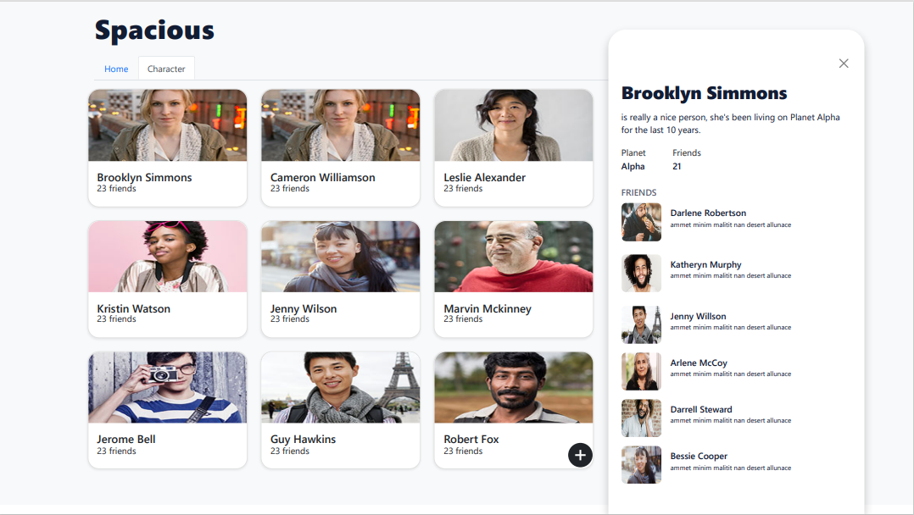

# Spacious App

## Overview

This app was created for Kodecamp stage 7 work. It is a app that includes planets and people living in them.

### Live Link : (http://muakone.github.io/planet_react).

## Features 

* The planet is displayed into cards to display its name and population.

* Clicking on any of the planets a sidepop comes up .

* The sidepop displays the name and the population of the card clicked.

* The Character is also displayed into cards to display its name and number of friends.

* Clicking on ony of the characters a sidepop comes up.

* The sidepop displays the name , planet and number of friends a character has dynamically.

### Screenshot

## Tech Used / Dependencies

* This is a React App boostrapped with CRA
* Add-on packages include:

  - React-Icon
* Fonts from [Google Fonts](https://fonts.google.com/)
* Icons from [React Icons](https://react-icons.github.io/react-icons/)

